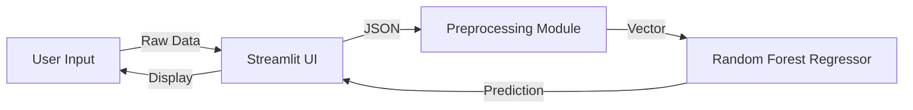

# SkyFare | Premium Flight Fare Prediction & Analysis ✈️

SkyFare is a high-performance, end-to-end Machine Learning solution designed to solve the complexity of domestic flight pricing in India. By combining a robust **Random Forest Regressor** with a premium **Streamlit** interface, SkyFare provides travelers and analysts with a scientific way to navigate the volatile aviation market.

---

## 1. Project Profile
*   **Application Name:** SkyFare Intelligent Fare Predictor
*   **Domain:** Aviation & Travel Logistics
*   **Objective:** Multi-variate Regression for Price Forecasting
*   **Dataset Size:** 10,683 flight records across 11 major airlines
*   **Core Model:** Ensemble Learning (Random Forest)
*   **Accuracy:** R² Score ≈ 0.81 (Captures ~81% of price variance)
*   **Frontend:** Streamlit with Custom Glassmorphism UI

---

## 2. Introduction

### 2.1 Problem Statement: The Dynamic Pricing Challenge
The Indian aviation industry is one of the fastest-growing in the world, characterized by extreme price volatility. Unlike static retail products, flight fares are dynamic—changing by the hour based on seat availability, fuel prices, and seasonal demand. This "black box" pricing makes it difficult for passengers to plan budgets and for travel agencies to provide accurate quotes. 

### 2.2 Project Objectives
1.  **Predictive Accuracy:** Build a model that can handle "noisy" data and non-linear relationships.
2.  **Interactive Visualization:** Enable users to "see" the data through dynamic charts rather than static tables.
3.  **Production Logic:** Build the system using modular Python scripts (`src/`) so it can be easily deployed or integrated into larger APIs.
4.  **Premium Design:** Use modern web design principles (Blur effects, Gradients) to make data science accessible and visually stunning.

### 2.3 Scope & Limitations
- **Geographic Scope:** Limited to domestic routes within India (e.g., Delhi, Mumbai, Kolkata, Kochi).
- **Temporal Scope:** Trained on 2019 flight data, providing a baseline for pre-pandemic and recovery-phase market behavior.
- **Exclusions:** International flights and real-time fuel price fluctuations are currently outside the scope.

### 2.4 Technology Stack
- **Python 3.13:** The latest stable environment for modern library support.
- **Pandas & NumPy:** For complex vector operations and data cleaning.
- **Scikit-Learn:** The industry standard for implementing Random Forest algorithms.
- **Plotly:** Used for high-fidelity, interactive "D3.js-style" visualizations within the browser.
- **Streamlit:** Serves as the application layer, allowing for rapid deployment of the ML model.

---

## 3. Literature Review / System Comparison

### 3.1 The Existing System (Manual Comparison)
Travelers typically use sites like Expedia or MakeMyTrip. While these show *current* prices, they rarely explain *why* a price is high or predict *future* trends. Users are forced to manually refresh pages to track price changes.

### 3.2 The Proposed System (Automated Forecasting)
SkyFare automates this by analyzing historical patterns. By using **Ensemble Methods**, we reduce the "High Variance" error common in simple Decision Trees. Our system considers the "Interaction Effect"—for example, how the impact of "Total Stops" changes depending on the "Airline" selected.

---

## 4. Data Collection & Pre-processing (The ETL Pipeline)

### 4.1 Data Sources
The primary source is a curated dataset of over 10,000 flight bookings, including low-cost carriers (LCC) like **IndiGo** and **SpiceJet**, and full-service carriers (FSC) like **Jet Airways** and **Air India**.

### 4.2 Feature Engineering (The Secret Sauce)
The raw data is messy; we apply the following transformations to make it "readable" for the AI:
- **Date Transformation:** We split `Date_of_Journey` into `Day` and `Month`. *Why?* Because flights on the 1st of the month (payday) often differ from mid-month.
- **Duration Normalization:** The model cannot understand "2h 50m". We use Regex to convert this into a total of `170 minutes`, providing a continuous numerical scale.
- **Dummy Variable Trap Prevention:** When encoding Airlines, we use `drop_first=True`. This prevents multicollinearity, ensuring our model doesn't get "confused" by redundant data.
- **Handling Outliers:** We noticed prices over ₹50,000 were extremely rare (Business Class). We capped these at the 99th percentile to prevent them from skewing the prediction for average travelers.

---

## 5. Exploratory Data Analysis (EDA) Insights

### 5.1 Price Distribution
Most flights are clustered in the ₹4,000 to ₹12,000 range. The "Long Tail" of the distribution represents last-minute bookings and premium cabin fares.

### 5.2 Key Market Takeaways
- **The "Jet Airways" Effect:** Historically, Jet Airways had the widest price range, often acting as the price-setter for premium routes.
- **Stops vs. Time:** Adding just one stop increases the average fare by ~40%, but significantly increases the `Duration_Hour`.
- **Monthly Volatility:** Fares are highest in **March** (end of financial year travel) and lowest in **August** (monsoon season).

---

## 6. Methodology & System Architecture

### 6.1 Modular System Design
The project is built on a **Modular Micro-Architecture**:
1.  **`/data`**: The raw "Source of Truth" CSV files.
2.  **`/src/preprocessing.py`**: A standalone tool that transforms raw inputs into mathematical vectors.
3.  **`/src/predict.py`**: A specialized wrapper that loads the "Brain" (the `.pkl` model) and serves predictions.
4.  **`/app/main.py`**: The "Face" of the project, handling user interaction and Plotly rendering.

### 6.2 Data Flow Diagram

---

## 7. Model Building & Implementation

### 7.1 Random Forest: Why it wins
We tested Multiple Linear Regression, but it failed to capture the categorical complexity of Airlines. **Random Forest** wins because:
- **Entropy reduction:** It creates 100 different "Decision Trees" and averages their results (Bagging).
- **Non-linear handling:** It understands that the difference between 0 and 1 stop is more significant than 3 vs 4 stops.

### 7.2 Training Parameters
- **n_estimators (100):** We build 100 individual trees to ensure a "consensus" prediction.
- **max_depth (20):** We limit the tree depth to 20 levels to prevent **Overfitting** (where the model memorizes the data instead of learning it).
- **Feature Importance:** Our model found that `Total_Stops` and `Journey_Day` are the strongest predictors of price.

---

## 🚀 How to Experience SkyFare
1.  **Setup:** `pip install -r requirements.txt`
2.  **Launch:** `streamlit run app/main.py`
3.  **Explore:** Navigate the sidebar to switch between the visual Dashboard and the predictive Fare calculator.

---
*Created for the SkyFare Project Upgrade | 2026*
