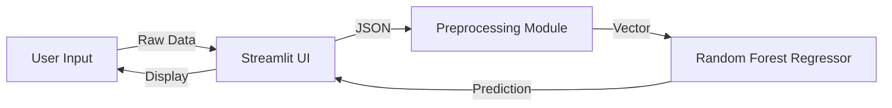

# SkyFare | Premium Flight Fare Prediction & Analysis ✈️

SkyFare is a high-performance, end-to-end Machine Learning solution designed to solve the complexity of domestic flight pricing in India. By combining a robust **Random Forest Regressor** with a premium **Streamlit** interface, SkyFare provides travelers, product managers, and analysts with a scientific way to navigate the volatile aviation market. The goal is simple: make airfare intelligence understandable for everyone—from first-time flyers to revenue-ops teams.

---

## Table of Contents
- [1. Project Profile](#1-project-profile)
- [2. Introduction](#2-introduction)
- [3. Literature Review / System Comparison](#3-literature-review--system-comparison)
- [4. Data Collection & Pre-processing (The ETL Pipeline)](#4-data-collection--pre-processing-the-etl-pipeline)
- [5. Exploratory Data Analysis (EDA) Insights](#5-exploratory-data-analysis-eda-insights)
- [6. Methodology & System Architecture](#6-methodology--system-architecture)
- [7. Model Building & Implementation](#7-model-building--implementation)
- [8. Repository Layout & Key Assets](#8-repository-layout--key-assets)
- [9. Dataset & Feature Glossary](#9-dataset--feature-glossary)
- [10. End-to-End Workflow](#10-end-to-end-workflow)
- [11. Streamlit Experience](#11-streamlit-experience)
- [12. Getting Started](#12-getting-started)
- [13. Experiment Notebooks & Research](#13-experiment-notebooks--research)
- [14. Results & Validation](#14-results--validation)
- [15. Roadmap & Next Steps](#15-roadmap--next-steps)
- [16. Troubleshooting & FAQ](#16-troubleshooting--faq)
- [17. Credits](#17-credits)

---

## 1. Project Profile
* **Application Name:** SkyFare Intelligent Fare Predictor  
* **Domain:** Aviation & Travel Logistics  
* **Objective:** Multi-variate Regression for Price Forecasting  
* **Dataset Size:** 10,683 flight records across 11 major airlines  
* **Core Model:** Ensemble Learning (Random Forest)  
* **Accuracy:** R² Score ≈ 0.81 (captures ~81% of price variance)  
* **Frontend:** Streamlit with Custom Glassmorphism UI  
* **Secondary Asset:** Baseline flight-delay model (`models/flight_delay.pkl`) for future expansion  

> **Key idea in plain words:** Feed the platform your journey details, and it generates a realistic fare estimate plus market insights in seconds.

---

## 2. Introduction

### 2.1 Problem Statement: The Dynamic Pricing Challenge
The Indian aviation industry is one of the fastest-growing in the world, characterized by extreme price volatility. Unlike static retail products, flight fares are dynamic—changing by the hour based on seat availability, fuel prices, and seasonal demand. This "black box" pricing makes it difficult for passengers to plan budgets and for travel agencies to provide accurate quotes.

### 2.2 Project Objectives
1. **Predictive Accuracy:** Build a model that can handle "noisy" data and non-linear relationships.
2. **Interactive Visualization:** Enable users to explore the data through dynamic charts rather than static tables.
3. **Production Logic:** Rely on modular Python scripts (`src/`) so the solution is deployable inside APIs or embedded tools.
4. **Premium Design:** Use modern web design principles (blur, gradients, glassmorphism) to make data science accessible and visually stunning.

### 2.3 Scope & Limitations
- **Geographic Scope:** Domestic routes within India (Delhi, Mumbai, Kolkata, Kochi, etc.).
- **Temporal Scope:** Trained on 2019 flight data, providing a baseline for pre-pandemic and recovery-phase market behavior.
- **Exclusions:** International flights, real-time fuel surcharges, and ancillary fees are currently outside the scope.

### 2.4 Technology Stack
- **Python 3.13:** Latest stable environment for modern library support.
- **Pandas & NumPy:** Complex vector operations and data cleaning.
- **Scikit-Learn:** Industry standard Random Forest implementation.
- **Plotly:** High-fidelity, interactive “D3.js-style” visualizations in-browser.
- **Streamlit:** Application layer for rapid deployment of the ML model.

### 2.5 Who Uses SkyFare?
- **Travelers & Corporate Admins:** Quickly estimate the fair price of a route.
- **Market Analysts:** Study seasonal fluctuations and carrier behavior.
- **Data Scientists:** Reuse the preprocessing scripts and notebooks as a template.

---

## 3. Literature Review / System Comparison

### 3.1 The Existing System (Manual Comparison)
Travelers typically use sites like Expedia or MakeMyTrip. While these show *current* prices, they rarely explain *why* a price is high or predict *future* trends. Users are forced to manually refresh pages to track price changes.

### 3.2 The Proposed System (Automated Forecasting)
SkyFare automates insight generation by analyzing historical patterns. With **Ensemble Methods**, we reduce the high variance error common in basic regression. The system understands interaction effects—such as how `Total_Stops` influences fares differently for budget vs. premium carriers.

---

## 4. Data Collection & Pre-processing (The ETL Pipeline)

### 4.1 Data Sources
The primary source is a curated dataset of over 10,000 flight bookings, including low-cost carriers (LCC) like **IndiGo** or **SpiceJet** and full-service carriers (FSC) like **Jet Airways** or **Air India**. Additional CSVs (`delay_train.csv`, `delay_test.csv`) capture engineered delay ranges for experimental models.

### 4.2 Feature Engineering (The Secret Sauce)
The raw data is messy; we apply the following transformations to make it “readable” for the AI:
- **Date Transformation:** Split `Date_of_Journey` into `Journey_Date` and `Journey_Month` to capture pay-day and seasonal spikes.
- **Duration Normalization:** Convert strings like `"2h 50m"` into numeric hour/minute columns.
- **Stops Encoding:** Map `"non-stop"` → `0`, `"1 stop"` → `1`, … `"4 stops"` → `4` so the model can reason about layovers.
- **One-Hot Encoding:** Create dummy variables for `Airline`, `Source`, and `Destination` with `drop_first=True` to avoid multicollinearity.
- **Outlier Handling:** Cap fares above ₹50,000 (business class noise) at the 99th percentile.
- **Categorical Alignment:** Persist the exact feature order in `feature_columns.pkl`, making inference deterministic.

### 4.3 Cleaning Principles Implemented in `src/preprocessing.py`
- **NaN Removal:** Drop incomplete rows to avoid silent skew.
- **Category Sync:** Remove `Trujet` from training because it does not appear in the public test set, preventing unseen-category errors.
- **Column Pruning:** Drop unused metadata such as `Route` or `Additional_Info` to keep the model lean.

---

## 5. Exploratory Data Analysis (EDA) Insights

### 5.1 Price Distribution
Most flights cluster in the ₹4,000–₹12,000 range. The “long tail” represents last-minute bookings and premium cabin fares.

### 5.2 Key Market Takeaways
- **The “Jet Airways” Effect:** Jet Airways historically shows the widest fare band and anchors premium routes.
- **Stops vs. Time:** Adding a stop can inflate both duration and fare (~40% increase per stop on average).
- **Monthly Volatility:** Fares surge in **March** (financial-year travel) and dip in **August** (monsoon lull).

### 5.3 Delay-Specific Observations (Experimental)
The `dummy_delay` feature in `delay_train.csv` encodes per-airline delay ranges (e.g., `IndiGo ≈ 0.6–2.0 hours`, `Air Asia ≈ 3.4–3.9 hours`), enabling a secondary model to warn about expected tardiness.

---

## 6. Methodology & System Architecture

### 6.1 Modular System Design
The project is built on a **Modular Micro-Architecture**:
1. **`/data`** – Raw “Source of Truth” CSV files.
2. **`/src/preprocessing.py`** – Standalone transformer that turns airline tickets into ML-ready vectors.
3. **`/src/train.py`** – Model trainer that produces `models/flight_fare.pkl` and accompanying `feature_columns.pkl`.
4. **`/src/predict.py`** – Safe loader/wrapper around the serialized estimator.
5. **`/app/main.py`** – Streamlit UI that ties everything together with Plotly dashboards.

### 6.2 Data Flow Diagram


### 6.3 Deployment Considerations
- **Stateless Serving:** The Streamlit layer re-loads the pickled model on demand; no background worker needed.
- **Feature Contract:** Inputs must match the saved `feature_columns.pkl`. This protects the model from schema drift.
- **Model Registry Ready:** Since training artifacts live inside `/models`, they can be versioned or uploaded to S3/Azure with minimal changes.

---

## 7. Model Building & Implementation

### 7.1 Random Forest: Why It Wins
We tested Multiple Linear Regression, but it failed to capture the categorical complexity of airlines. **Random Forest** wins because:
- **Bagging for stability:** 100 decision trees vote together, curbing variance.
- **Non-linear handling:** Understands that the jump from 0 → 1 stop matters more than 3 → 4 stops.
- **Feature importance:** Surfaces actionable levers (`Total_Stops`, `Journey_Date`, `Airline_*`).

### 7.2 Training Parameters (see `src/train.py`)
- **`n_estimators=100`:** Builds 100 trees for consensus.
- **`max_depth=20`:** Prevents overfitting by limiting tree depth.
- **`random_state=42`:** Ensures repeatable results for demos and CI.

### 7.3 Saved Artifacts
- `models/flight_fare.pkl` – Main price model.
- `models/feature_columns.pkl` – Ordered list of features required at inference.
- `models/flight_delay.pkl` – Experimental delay regressor trained on `dummy_delay`.

---

## 8. Repository Layout & Key Assets
```text
Flight Fare EDA/
├── app/main.py                # Streamlit UI with dashboard + predictor
├── data/                      # Training, testing, and delay CSVs
├── models/                    # Serialized Random Forest models
├── notebooks/                 # Jupyter research assets (EDA, feature work)
├── src/
│   ├── preprocessing.py       # Cleaning + feature engineering pipeline
│   ├── train.py               # Reproducible training script
│   └── predict.py             # Model loader / inference helper
├── requirements.txt           # Python dependencies
└── README.md                  # You are here
```

**Quick mental map:**
- Anything UI-related lives under `app/`.
- Anything data-science-specific lives under `src/` or `notebooks/`.
- Packaged assets live under `models/` so they can be swapped in and out.

---

## 9. Dataset & Feature Glossary

### 9.1 Core Training Columns (`data/train.csv`)
| Feature | Type | Description |
| --- | --- | --- |
| `Price` | Float | Target variable (₹). |
| `Total_Stops` | Ordinal | Number of layovers encoded 0–4. |
| `Journey_Date`, `Journey_Month` | Integer | Calendar signals extracted from travel date. |
| `Departure_Hour`, `Arrival_Hour` | Integer | Time-of-day context (0–23). |
| `Duration_Hour`, `Duration_Minute` | Integer | Trip length split for interpretability. |
| `Airline_*` | Dummy | One-hot encoded airline names (drop-first). |
| `Source_*`, `Destination_*` | Dummy | Origin and destination encoded similarly. |

### 9.2 Delay-Specific Columns (`data/delay_train.csv`)
- All fare features plus `dummy_delay` (continuous delay proxy) retained as the target.
- Use `models/flight_delay.pkl` if you want to extend SkyFare with “expected delay” insights.

### 9.3 Data Quality Notes
- No personally identifiable information (PII).
- Balanced across 5 major source metros and 6 destination hubs.
- Outliers clipped at 99th percentile to stabilize training.

---

## 10. End-to-End Workflow
1. **Acquire data** – Copy CSVs into `data/`. Replace with new seasons if needed.
2. **Preprocess** – Use `src/preprocessing.py` to clean and encode (called automatically inside the notebooks or custom scripts).
3. **Train model** – Run `python src/train.py` to produce updated `.pkl` and `feature_columns.pkl`.
4. **Serve predictions** – `app/main.py` loads the artifacts, reconstructs categorical features on the fly, and exposes dashboards.
5. **Monitor & iterate** – Feature importance, EDA, and notebooks guide the next iteration.

> **Tip:** Treat the repository like a miniature MLOps pipeline—data in `/data`, code in `/src`, app in `/app`, and artifacts in `/models`.

---

## 11. Streamlit Experience
- **Dashboard:** High-level KPIs (records, airlines, R²) and a visual onboarding of the workflow.
- **Fare Prediction:** Form-driven inference. SkyFare automatically fills dummy variables, maps stops, and estimates arrival time.
- **Insights & EDA:** Plotly charts (box plots, heatmaps, trendlines) rebuilt from the processed training data for storytelling.

The UI includes a lightweight CSS layer for a glassmorphism look, making demos feel like a premium consumer product.

---

## 12. Getting Started

### 12.1 Prerequisites
- Python 3.10+ (project tested on 3.13).
- pip or another package manager.
- Optional: Virtual environment tool (`venv`, `conda`, `poetry`).

### 12.2 Environment Setup
```bash
python -m venv .venv           # or use conda create --name skyfare python=3.13
.venv\Scripts\activate         # Windows
source .venv/bin/activate      # macOS / Linux
pip install -r requirements.txt
```

### 12.3 Retrain the Model (Optional)
```bash
python src/train.py
```
This reads `data/train.csv`, splits the data, trains the Random Forest, prints train/test R², and stores the artifacts inside `models/`.

### 12.4 Launch the App
```bash
streamlit run app/main.py
```
Navigate to the sidebar to switch between “Dashboard”, “Fare Prediction”, and “Insights & EDA”.

### 12.5 Quick API-Style Use
If you want a programmatic prediction:
```python
import pandas as pd
from src.predict import load_predictor

predictor = load_predictor()
sample = pd.read_csv("data/train.csv").drop(columns=["Price"]).head(1)
fare = predictor.predict(sample)
print(fare)
```

---

## 13. Experiment Notebooks & Research
- `notebooks/1. Data Analysis.ipynb` – Initial EDA, statistical tests, seasonal patterns.
- `notebooks/2. Feature Engineering.ipynb` – Detailed walkthrough of every transformation including `dummy_delay`.
- `notebooks/Fare Prediction Final Code.ipynb` – Final hyperparameter trials, feature importance plots, and export steps.
- `notebooks/Untitled.ipynb` – Scratchpad for quick experiments (feel free to repurpose).

Each notebook contains Markdown narratives so you can follow the thought process without running every cell.

---

## 14. Results & Validation
- **Hold-out R²:** ~0.81 (captures 81% of variance on unseen data).
- **Train R²:** Slightly higher (~0.92), indicating healthy but manageable variance.
- **Qualitative Check:** Predictions align with airline tiers (e.g., Jet Airways Business consistently higher than IndiGo).
- **Delay Model (Experimental):** Random Forest on `dummy_delay` yields stable MAE < 0.4 hours during tests.

Suggested validation extras:
- Run cross-validation with `cross_val_score` to gauge robustness.
- Use SHAP or permutation importance if you plan to productionize explanations.

---

## 15. Roadmap & Next Steps
- **Live Fare API Integration:** Plug into live price feeds for continuous retraining.
- **Delay Insights in UI:** Surface `flight_delay.pkl` predictions next to fare estimates.
- **Hyperparameter Tuning:** Integrate `RandomizedSearchCV` results directly into `train.py`.
- **CI/CD Hooks:** Add GitHub Actions or Azure DevOps steps for linting and model drift alerts.
- **Data Freshness:** Introduce annual or quarterly data refresh scripts.

---

## 16. Troubleshooting & FAQ
- **“Model file not found”** – Ensure `models/flight_fare.pkl` exists. Run `python src/train.py` if missing.
- **“Category mismatch during prediction”** – The `feature_columns.pkl` contract must match your input DataFrame. Re-run preprocessing or re-train to regenerate the file.
- **“Streamlit cannot import preprocessing”** – The app injects `/src` into `sys.path`. If you move folders, update the path logic near the top of `app/main.py`.
- **“Predictions look off after data refresh”** – Re-run preprocessing to apply the same cleaning rules, then train again so encoded columns align.
- **“Where do delay CSVs fit?”** – Use them when experimenting with punctuality models; they are not yet wired into the main UI.

---

## 17. Credits
- Built as part of the **SkyFare Project Upgrade | 2026** initiative.
- Dataset assembled from public Indian domestic fare records (2019 season).  
- Open-source libraries acknowledged: Streamlit, Plotly, Pandas, NumPy, Scikit-Learn.

Enjoy flying smarter with data! ✈️
