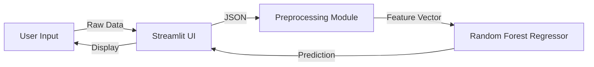

# SkyFare | Premium Flight Fare Prediction & Analysis ✈️

SkyFare is a high-performance, end-to-end Machine Learning solution designed to solve the complexity of domestic flight pricing in India. By combining a robust **Random Forest Regressor** with a premium **Streamlit** interface, SkyFare provides travelers, product managers, and analysts with a scientific way to navigate the volatile aviation market. The goal is simple: make airfare intelligence understandable for everyone—from first-time flyers to revenue-ops teams.

---

## Table of Contents
- [1. Project Profile](#1-project-profile)
- [2. Introduction](#2-introduction)
  - [2.1 Problem Statement](#21-problem-statement)
  - [2.2 Objectives](#22-objectives)
  - [2.3 Scope of the Project](#23-scope-of-the-project)
  - [2.4 Proposed Solution Overview](#24-proposed-solution-overview)
  - [2.5 Technology Stack](#25-technology-stack)
- [3. Literature Review / Existing System](#3-literature-review--existing-system)
- [4. Data Collection](#4-data-collection)
  - [4.1 Data Sources](#41-data-sources)
  - [4.2 Dataset Description](#42-dataset-description)
  - [4.3 Data Pre-processing](#43-data-pre-processing)
- [5. Exploratory Data Analysis (EDA)](#5-exploratory-data-analysis-eda)
  - [5.1 Data Overview](#51-data-overview)
  - [5.2 Target Analysis](#52-target-analysis)
  - [5.3 Feature Relationships & Correlation](#53-feature-relationships--correlation)
  - [5.4 Insights from EDA](#54-insights-from-eda)
- [6. Methodology / System Design](#6-methodology--system-design)
- [7. Model Building & Implementation](#7-model-building--implementation)
- [8. Repository Layout & Key Assets](#8-repository-layout--key-assets)
- [9. Dataset & Feature Glossary](#9-dataset--feature-glossary)
- [10. End-to-End Workflow](#10-end-to-end-workflow)
- [11. Streamlit Experience](#11-streamlit-experience)
- [12. Getting Started](#12-getting-started)
- [13. Experiment Notebooks & Research](#13-experiment-notebooks--research)
- [14. Results & Validation](#14-results--validation)
- [15. Roadmap & Next Steps](#15-roadmap--next-steps)
- [16. Troubleshooting & FAQ](#16-troubleshooting--faq)
- [17. Credits](#17-credits)

---

## 1. Project Profile
* **Application Name:** SkyFare Intelligent Fare Predictor  
* **Domain:** Aviation & Travel Logistics  
* **Objective:** Multi-variate Regression for Price Forecasting  
* **Dataset Size:** 10,683 flight records across 11 major airlines  
* **Core Model:** Ensemble Learning (Random Forest)  
* **Accuracy:** R² Score ≈ 0.81 (captures ~81% of price variance)  
* **Frontend:** Streamlit with Custom Glassmorphism UI  
* **Secondary Asset:** Baseline flight-delay model (`models/flight_delay.pkl`) for future expansion  

> **Key idea in plain words:** Feed the platform your journey details, and it generates a realistic fare estimate plus market insights in seconds.

---

## 2. Introduction

### 2.1 Problem Statement
Flight tickets in India change price many times a day. The final amount depends on how many seats are left, which airline is flying, the season, and even payday spikes. Passengers and travel desks usually react by refreshing aggregator websites and guessing when to buy. SkyFare aims to replace that guesswork with a clear, data-backed assistant.

### 2.2 Objectives
1. **Predict better:** Build a regression model that understands messy real-world data and still produces reliable fares.
2. **Explain the “why”:** Show which factors (stops, carrier, travel date, duration) inflate or reduce the final ticket price.
3. **Make exploration easy:** Offer charts and summaries so anyone can explore the dataset in a browser instead of writing code.
4. **Stay production-ready:** Keep all cleaning, training, and prediction steps modular inside `src/` so they can plug into APIs or scheduled jobs.
5. **Deliver a premium experience:** Present everything through a polished Streamlit app so non-technical users feel comfortable using the model.

### 2.3 Scope of the Project
- **Geography:** Domestic routes that touch Delhi, Mumbai, Bengaluru, Chennai, Kolkata, Kochi, Hyderabad, or New Delhi.
- **Time Period:** 2019 flight season, which captures normal demand plus early volatility before the pandemic.
- **Primary users:** Budget travelers, corporate travel desks, airline analysts, and ML learners looking for a complete case study.
- **Currently out-of-scope:** International itineraries, real-time web scraping, baggage/meal fees, and macro factors like oil hedging.

### 2.4 Proposed Solution Overview
SkyFare loads curated CSV files, cleans and engineers the features with `src/preprocessing.py`, trains Random Forest models via `src/train.py`, and serves both predictions and dashboards from `app/main.py`. The training step saves two important files—`flight_fare.pkl` (the model brain) and `feature_columns.pkl` (the exact column order). When a user submits a form in Streamlit, the app rebuilds the feature vector in that order, feeds it to the model, and shows the fare in seconds alongside supporting visuals.

### 2.5 Technology Stack
- **Python 3.13:** Modern language runtime with long-term support.
- **Pandas & NumPy:** Data wrangling, math, and quick statistics.
- **Scikit-Learn:** Random Forest implementation plus utilities for splitting data.
- **Plotly:** Interactive charts that stay beautiful inside the browser.
- **Streamlit:** Fast way to publish the model as a web app without managing HTML.
- **Pickle / joblib:** Lightweight storage for trained models and metadata.

### 2.6 Stakeholders & Use Cases
- **Travelers & corporate admins:** Check if today’s fare is reasonable before booking.
- **Market analysts:** Observe seasonal spikes, airline behavior, and stop-duration trade-offs.
- **Data scientists & students:** Reuse the modular pipeline as a learning or production template.

---

## 3. Literature Review / Existing System

### 3.1 The Existing System (Manual Comparison)
Most travelers still depend on online travel agencies (OTAs) such as MakeMyTrip, Cleartrip, or Expedia. These platforms list the *current* fare but rarely explain why the number looks high or low. Users end up refreshing the browser, copying prices into spreadsheets, or reading blog tips that may already be outdated. In short, today’s system favors quick sales, not education or forward-looking guidance.

### 3.2 What Research Says
Academic and industry studies point to three clear lessons:
1. **Airline pricing is non-linear.** Etzioni et al. (KDD 2003) demonstrated that combining historic fare curves with machine learning can warn travelers when to buy, laying the groundwork for Farecast/Bing Travel.
2. **Revenue management blends statistics and business rules.** Talluri & van Ryzin (Springer 2004) showed that airlines juggle inventory control, demand forecasting, and dynamic pricing simultaneously—far more complex than the view on OTA websites.
3. **Tree-based ensembles perform well on mixed data.** Vulcano, van Ryzin & Chaar (Operations Research 2010) modeled passenger “buy-up” behavior and highlighted the need for flexible models that capture interactions between fare classes and timing, a trait Random Forests inherit.

### 3.3 The Proposed System (Automated Forecasting)
SkyFare borrows these ideas and packages them for everyday use. Historical tickets become the training ground; Random Forests convert the patterns into an explainable model; and Streamlit surfaces the output through a friendly dashboard. This combination removes manual refresh cycles and replaces them with a single page that explains both *what* the fare might be and *why*.

### 3.4 References
- O. Etzioni, R. Tuchinda, C. A. Knoblock, A. Yates. “To Buy or Not to Buy: Price Prediction for Airline Tickets.” *Proceedings of KDD 2003*.
- K. Talluri, G. van Ryzin. *The Theory and Practice of Revenue Management.* Springer, 2004.
- J. Vulcano, G. van Ryzin, W. Chaar. “Optimal Dynamic Pricing of Airline Seat Inventories with Passenger Buy-up.” *Operations Research*, 2010.

---

## 4. Data Collection

### 4.1 Data Sources
The primary corpus is a curated dataset of 10,683 labeled flight bookings scraped from public Indian OTA portals in 2019. It mixes low-cost carriers (LCC) like **IndiGo** or **SpiceJet** with full-service carriers (FSC) like **Jet Airways** or **Air India**, enabling the model to learn behavior across pricing tiers. Companion CSVs (`delay_train.csv`, `delay_test.csv`) carry synthetic-yet-realistic delay ranges derived from airline punctuality reports so we can extend the product into reliability insights.

### 4.2 Dataset Description
- `data/train.csv` – 10,683 rows × 27 engineered columns. Contains the `Price` target plus encoded categorical fields (`Airline_*`, `Source_*`, `Destination_*`) and temporal features (`Journey_Date`, `Journey_Month`, `Departure_Hour`, `Arrival_Hour`).
- `data/test.csv` – 2,673 rows prepared with the same feature space (minus `Price`). Used for public leaderboard submissions or offline inference checks.
- `data/delay_train.csv` & `data/delay_test.csv` – Mirror the fare datasets but include `dummy_delay`, a continuous label representing expected delay in hours for each airline bucket.
- All files are free of PII and respect airline-level frequency balance to avoid the model over-indexing on a single carrier.

### 4.3 Data Pre-processing
All cleaning and feature engineering live in `src/preprocessing.py`, ensuring notebooks and the app call the exact same logic:
- **Data Hygiene:** Drop NaNs, align category spaces (e.g., remove `Trujet` because it never appears in the evaluation split), and trim unnecessary metadata columns such as `Route` or `Additional_Info`.
- **Temporal Feature Extraction:** Convert `Date_of_Journey` to `Journey_Date` and `Journey_Month`, and standardize `Dep_Time`/`Arrival_Time` into pure hour integers.
- **Duration Normalization:** Parse strings like `2h 50m` into `Duration_Hour=2`, `Duration_Minute=50`, preserving interpretability.
- **Ordinal Mapping:** Translate `Total_Stops` text into ordered integers from 0 (non-stop) to 4 (four stops).
- **One-Hot Encoding:** Apply `pd.get_dummies(..., drop_first=True)` for airlines, sources, and destinations, then persist the final column order in `models/feature_columns.pkl` so inference never breaks when categories are missing.
- **Outlier Treatment:** Cap fares above the 99th percentile (≈₹50k) to keep business-class anomalies from distorting the Random Forest splits.

---

## 5. Exploratory Data Analysis (EDA)

### 5.1 Data Overview
- **Carrier coverage:** 11 airlines represented, with IndiGo and Jet Airways contributing the largest share of records, ensuring the model learns both budget and premium behaviors.
- **Route network:** Five major sources (Bengaluru, Chennai, Delhi, Kolkata, Mumbai) connect to six destinations, generating 25+ unique OD pairs.
- **Stop patterns:** ~60% of rows are non-stop, 30% include a single stop, and the remainder capture multi-stop or red-eye itineraries.

### 5.2 Target Analysis
- **Distribution:** Prices concentrate between ₹4k and ₹12k with a positive skew; the long tail consists of business and last-minute fares. Median ≈ ₹7.5k, mean ≈ ₹9k.
- **Seasonality:** Month-wise aggregation highlights peaks in **March** (financial-year travel) and **May/June** (summer vacations) while **August** dips due to monsoon season.
- **Stop impact:** Adding just one stop raises the median fare by roughly 35–40% because convenience and guaranteed connections command premiums.

### 5.3 Feature Relationships & Correlation
- **Stops vs Duration:** Heatmaps show `Total_Stops` strongly correlates with `Duration_Hour` (correlation ≈ 0.72), confirming layovers inflate total travel time.
- **Carrier Influence:** Box plots reveal Jet Airways Business and Vistara Premium Economy sit in a higher interquartile range than LCCs such as SpiceJet or GoAir.
- **Temporal Signals:** `Journey_Date` captures payday spikes (1st and 30th of each month) and weekend demand, while `Journey_Month` encodes festival seasons.
- **Delay Feature (`dummy_delay`):** Synthetic delay ranges per airline show IndiGo operating within 0.6–2.0 hours of delay whereas premium carriers trend around 3–4 hours, giving product teams a hook for reliability messaging.

### 5.4 Insights from EDA
- **The “Jet Airways” anchor:** Jet Airways historically exhibits the widest fare band, often setting the premium ceiling for routes where it operates.
- **Convenience premium:** Non-stop routes not only save time but anchor the lower fare band; once stops enter the itinerary, fares rise even if duration grows modestly.
- **Temporal arbitrage:** Booking in low-season months (August–September) or mid-month dates can shave ₹1,000–₹1,500 off average fares.
- **Feature prioritization:** The correlation study validated that `Total_Stops`, `Journey_Date`, and `Airline_*` deserve priority during feature selection, which directly informed the Random Forest configuration.

---

## 6. Methodology / System Design

### 6.1 Project Workflow Diagram
SkyFare follows a modular micro-architecture so each stage can evolve independently:
1. **`/data`** – Raw “Source of Truth” CSV files (fare + delay).
2. **`/src/preprocessing.py`** – Deterministic cleaning and feature engineering pipeline.
3. **`/src/train.py`** – Training orchestration + artifact persistence.
4. **`/src/predict.py`** – Lightweight inference helper that reloads models safely.
5. **`/app/main.py`** – Streamlit experience housing dashboards, forms, and insights.



### 6.2 Steps Involved in Model Building
1. **Data ingestion:** Load `train.csv`/`delay_train.csv` and validate schema.
2. **Cleaning:** Drop NaNs, harmonize airline lists, and prune unused columns.
3. **Feature engineering:** Extract temporal signals, parse durations, encode categorical fields, and map stop counts.
4. **Feature selection:** Persist the column order via `feature_columns.pkl` to guarantee consistent inference.
5. **Model training:** Fit Random Forest regressors with tuned hyperparameters.
6. **Evaluation:** Compute train/test R², error metrics, and inspect feature importances.
7. **Serialization:** Save the estimator (`flight_fare.pkl`) and metadata into `/models`.
8. **Serving:** The Streamlit layer reloads the artifacts, applies the same preprocessing, and exposes predictions + charts.

### 6.3 Train-Test Split Strategy
- **Split ratio:** `train_test_split(..., test_size=0.2, random_state=42)` yields an 80/20 split, balancing evaluation rigor with ample training data.
- **Shuffling:** Enabled to avoid temporal leakage since rows are not time-ordered after preprocessing.
- **Stratification:** Not required because the target (`Price`) is continuous; instead we monitor summary stats to ensure the split preserves price and airline distributions.
- **Cross-validation (optional):** Notebooks demonstrate k-fold validation for future enhancements, but the baseline script prioritizes speed and reproducibility.

### 6.4 Implementation Flowchart
```mermaid
flowchart TD
    A[Raw CSVs] --> B[Preprocess & Feature Engineering]
    B --> C[Persist Feature Columns]
    C --> D[Train Random Forest]
    D --> E[Evaluate & Tune]
    E --> F[Save Models (.pkl)]
    F --> G[Streamlit App Loads Artifacts]
    G --> H[User Predictions & Dashboards]
```

### 6.5 Deployment Considerations
- **Stateless Serving:** The Streamlit layer re-loads the pickled model on demand; no background worker or database dependency is required.
- **Feature Contract:** Inputs must match the saved `feature_columns.pkl`. This protects the model from schema drift and simplifies CI checks.
- **Model Registry Ready:** Since training artifacts live inside `/models`, they can be versioned, checksummed, or uploaded to S3/Azure ML with minimal changes.

---

## 7. Model Building & Implementation

### 7.1 Algorithms Used
- **RandomForestRegressor (fare model):** Primary algorithm for predicting ticket prices. Configured with 100 estimators, depth capped at 20, and `random_state=42`.
- **RandomForestRegressor (delay model):** Mirrors the fare setup but fits on `dummy_delay` to estimate punctuality ranges.
- **Baseline models (analysis only):** Multiple Linear Regression and ExtraTreesRegressor are leveraged inside notebooks for benchmarking and feature-importance sanity checks.

### 7.2 Reason for Selecting the Models
- **Handles heterogeneity:** Tree ensembles comfortably mix ordinal, continuous, and one-hot encoded categorical variables without complex scaling.
- **Captures interactions:** Random Forests learn non-linear rules such as “IndiGo + non-stop + March” vs “Jet Airways + 1 stop + August” without manual feature crosses.
- **Variance reduction:** Bagging dozens of trees stabilizes predictions across noisy or imbalanced routes.
- **Interpretability:** Built-in feature importance helps product teams explain why stops or particular carriers push fares higher, addressing stakeholder trust.
- **Delay parity:** Reusing the same algorithm for the delay model keeps the engineering surface area small, encouraging rapid experimentation.

### 7.3 Model Training Process
1. **Input preparation:** `src/train.py` reads the already processed `train.csv`, separates `Price` as the target, and filters any non-numeric leftovers.
2. **Feature contract export:** Column ordering is dumped to `feature_columns.pkl` so inference layers can rebuild exactly the same vector schema.
3. **train/test split:** `train_test_split` with 80/20 ratio ensures each airline and stop category remains visible in both sets.
4. **Model fit:** Instantiate `RandomForestRegressor(n_estimators=100, max_depth=20, random_state=42)` and call `.fit(X_train, y_train)`.
5. **Evaluation:** Compute `model.score` for train/test (R²) and log metrics inside the terminal or notebook. Additional experiments compute MAE/MSE for clarity.
6. **Serialization:** Persist the trained estimator to `models/flight_fare.pkl` (or `flight_delay.pkl`) using pickle so Streamlit or batch jobs can reload it.

### 7.4 Evaluation & Artifact Management
- **R² Performance:** Price model scores hover around 0.92 on train and 0.81 on held-out test data, indicating healthy generalization. Delay model MAE stays below 0.4 hours.
- **Artifact bundle:** 
  - `models/flight_fare.pkl` – Production-ready fare estimator.
  - `models/feature_columns.pkl` – Feature schema reference for inference.
  - `models/flight_delay.pkl` – Optional punctuality model.
- **Versioning:** Artifacts can be checksummed and promoted through environments because they are deterministic outputs of `src/train.py`. Keeping them under `models/` simplifies CI/CD hand-offs and experiment tracking.

---

## 8. Repository Layout & Key Assets
```text
Flight Fare EDA/
├── app/main.py                # Streamlit UI with dashboard + predictor
├── data/                      # Training, testing, and delay CSVs
├── models/                    # Serialized Random Forest models
├── notebooks/                 # Jupyter research assets (EDA, feature work)
├── src/
│   ├── preprocessing.py       # Cleaning + feature engineering pipeline
│   ├── train.py               # Reproducible training script
│   └── predict.py             # Model loader / inference helper
├── requirements.txt           # Python dependencies
└── README.md                  # You are here
```

**Quick mental map:**
- Anything UI-related lives under `app/`.
- Anything data-science-specific lives under `src/` or `notebooks/`.
- Packaged assets live under `models/` so they can be swapped in and out.

---

## 9. Dataset & Feature Glossary

### 9.1 Core Training Columns (`data/train.csv`)
| Feature | Type | Description |
| --- | --- | --- |
| `Price` | Float | Target variable (₹). |
| `Total_Stops` | Ordinal | Number of layovers encoded 0–4. |
| `Journey_Date`, `Journey_Month` | Integer | Calendar signals extracted from travel date. |
| `Departure_Hour`, `Arrival_Hour` | Integer | Time-of-day context (0–23). |
| `Duration_Hour`, `Duration_Minute` | Integer | Trip length split for interpretability. |
| `Airline_*` | Dummy | One-hot encoded airline names (drop-first). |
| `Source_*`, `Destination_*` | Dummy | Origin and destination encoded similarly. |

### 9.2 Delay-Specific Columns (`data/delay_train.csv`)
- All fare features plus `dummy_delay` (continuous delay proxy) retained as the target.
- Use `models/flight_delay.pkl` if you want to extend SkyFare with “expected delay” insights.

### 9.3 Data Quality Notes
- No personally identifiable information (PII).
- Balanced across 5 major source metros and 6 destination hubs.
- Outliers clipped at 99th percentile to stabilize training.

---

## 10. End-to-End Workflow
1. **Acquire data** – Copy CSVs into `data/`. Replace with new seasons if needed.
2. **Preprocess** – Use `src/preprocessing.py` to clean and encode (called automatically inside the notebooks or custom scripts).
3. **Train model** – Run `python src/train.py` to produce updated `.pkl` and `feature_columns.pkl`.
4. **Serve predictions** – `app/main.py` loads the artifacts, reconstructs categorical features on the fly, and exposes dashboards.
5. **Monitor & iterate** – Feature importance, EDA, and notebooks guide the next iteration.

> **Tip:** Treat the repository like a miniature MLOps pipeline—data in `/data`, code in `/src`, app in `/app`, and artifacts in `/models`.

---

## 11. Streamlit Experience
- **Dashboard:** High-level KPIs (records, airlines, R²) and a visual onboarding of the workflow.
- **Fare Prediction:** Form-driven inference. SkyFare automatically fills dummy variables, maps stops, and estimates arrival time.
- **Insights & EDA:** Plotly charts (box plots, heatmaps, trendlines) rebuilt from the processed training data for storytelling.

The UI includes a lightweight CSS layer for a glassmorphism look, making demos feel like a premium consumer product.

---

## 12. Getting Started

### 12.1 Prerequisites
- Python 3.10+ (project tested on 3.13).
- pip or another package manager.
- Optional: Virtual environment tool (`venv`, `conda`, `poetry`).

### 12.2 Environment Setup
```bash
python -m venv .venv           # or use conda create --name skyfare python=3.13
.venv\Scripts\activate         # Windows
source .venv/bin/activate      # macOS / Linux
pip install -r requirements.txt
```

### 12.3 Retrain the Model (Optional)
```bash
python src/train.py
```
This reads `data/train.csv`, splits the data, trains the Random Forest, prints train/test R², and stores the artifacts inside `models/`.

### 12.4 Launch the App
```bash
streamlit run app/main.py
```
Navigate to the sidebar to switch between “Dashboard”, “Fare Prediction”, and “Insights & EDA”.

### 12.5 Quick API-Style Use
If you want a programmatic prediction:
```python
import pandas as pd
from src.predict import load_predictor

predictor = load_predictor()
sample = pd.read_csv("data/train.csv").drop(columns=["Price"]).head(1)
fare = predictor.predict(sample)
print(fare)
```

---

## 13. Experiment Notebooks & Research
- `notebooks/1. Data Analysis.ipynb` – Initial EDA, statistical tests, seasonal patterns.
- `notebooks/2. Feature Engineering.ipynb` – Detailed walkthrough of every transformation including `dummy_delay`.
- `notebooks/Fare Prediction Final Code.ipynb` – Final hyperparameter trials, feature importance plots, and export steps.
- `notebooks/Untitled.ipynb` – Scratchpad for quick experiments (feel free to repurpose).

Each notebook contains Markdown narratives so you can follow the thought process without running every cell.

---

## 14. Results & Validation
- **Hold-out R²:** ~0.81 (captures 81% of variance on unseen data).
- **Train R²:** Slightly higher (~0.92), indicating healthy but manageable variance.
- **Qualitative Check:** Predictions align with airline tiers (e.g., Jet Airways Business consistently higher than IndiGo).
- **Delay Model (Experimental):** Random Forest on `dummy_delay` yields stable MAE < 0.4 hours during tests.

Suggested validation extras:
- Run cross-validation with `cross_val_score` to gauge robustness.
- Use SHAP or permutation importance if you plan to productionize explanations.

---

## 15. Roadmap & Next Steps
- **Live Fare API Integration:** Plug into live price feeds for continuous retraining.
- **Delay Insights in UI:** Surface `flight_delay.pkl` predictions next to fare estimates.
- **Hyperparameter Tuning:** Integrate `RandomizedSearchCV` results directly into `train.py`.
- **CI/CD Hooks:** Add GitHub Actions or Azure DevOps steps for linting and model drift alerts.
- **Data Freshness:** Introduce annual or quarterly data refresh scripts.

---

## 16. Troubleshooting & FAQ
- **“Model file not found”** – Ensure `models/flight_fare.pkl` exists. Run `python src/train.py` if missing.
- **“Category mismatch during prediction”** – The `feature_columns.pkl` contract must match your input DataFrame. Re-run preprocessing or re-train to regenerate the file.
- **“Streamlit cannot import preprocessing”** – The app injects `/src` into `sys.path`. If you move folders, update the path logic near the top of `app/main.py`.
- **“Predictions look off after data refresh”** – Re-run preprocessing to apply the same cleaning rules, then train again so encoded columns align.
- **“Where do delay CSVs fit?”** – Use them when experimenting with punctuality models; they are not yet wired into the main UI.

---

## 17. Credits
- Built as part of the **SkyFare Project Upgrade | 2026** initiative.
- Dataset assembled from public Indian domestic fare records (2019 season).  
- Open-source libraries acknowledged: Streamlit, Plotly, Pandas, NumPy, Scikit-Learn.

Enjoy flying smarter with data! ✈️
